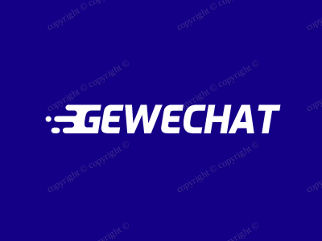
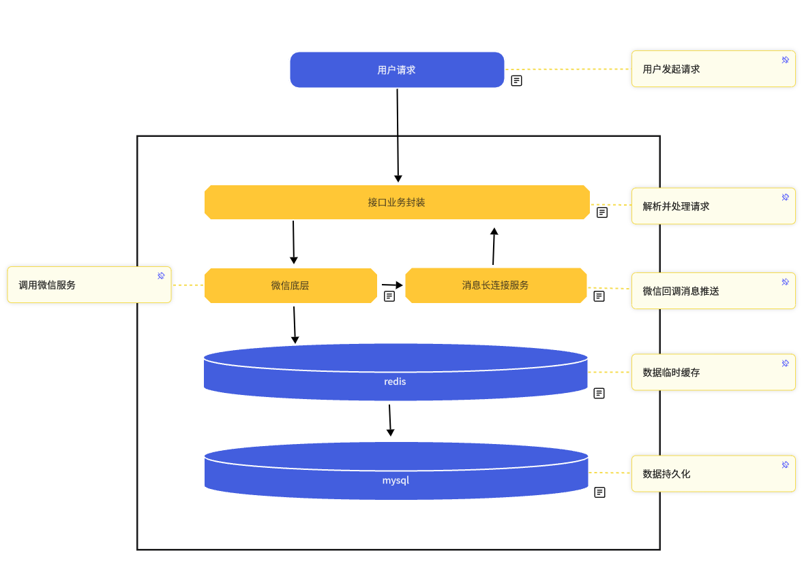

<p align="center">
  
</p>

# Gewechat（技术归档）

> [!IMPORTANT]
> **本项目已停止维护。**
>
> Gewechat 的历史运行服务、Docker 镜像、部署方式及技术支持均不再提供。本仓库仅作为技术归档和历史代码示例保留，请勿根据旧教程、旧镜像或第三方分发内容判断项目仍然可用。

停止维护背景可参阅：[针对违规获取及利用微信终端用户数据行为的打击公告](https://mp.weixin.qq.com/s/A6h4ZLTE2EPrY7kJ5fHE2g)。

## 关于本仓库

Gewechat 曾尝试用 REST API 将个人微信相关能力与具体编程语言、业务框架解耦，让开发者能够把消息事件接入自己的 AI 助手、客服系统或自动化流程。

从当前仓库内容看，这里保留的是：

- Java 8 调用示例；
- 基于 OkHttp 的 HTTP 请求封装；
- 登录、联系人、群、消息、标签、收藏等 API 模块示例；
- 一份历史架构图及社区集成索引。

这里**不包含完整服务端实现**，也不再提供可运行的底层服务、镜像、安装包、更新或可用性承诺。

## 项目结构

```text
src/main/java/
├── Demo.java                 # 历史调用示例
├── api/base/                 # 按业务域划分的 API 封装
│   ├── LoginApi.java
│   ├── ContactApi.java
│   ├── GroupApi.java
│   ├── MessageApi.java
│   ├── DownloadApi.java       # 媒体下载接口封装
│   ├── LabelApi.java
│   ├── FavorApi.java
│   └── PersonalApi.java
└── util/OkhttpUtil.java      # HTTP、Token Header 与 JSON 请求封装
```

这些代码的主要价值是展示一种轻量的 API Client 分层方式，而不是提供一套当前可部署的微信运行环境。

> [!WARNING]
> **历史客户端代码未经过生产级安全加固，不得直接复用。**
>
> 当前 `OkhttpUtil.java` 保留了明文 HTTP 占位地址、源码内静态 Token 占位字段、信任所有证书、跳过主机名校验和打印完整响应等历史模式。这些实现只用于理解历史接口分层；生产实现必须使用 HTTPS、标准证书与主机名校验、安全凭证注入，以及敏感日志脱敏。

## 历史技术设计

### 1. 用 REST API 隔离业务系统

调用方只需要构造 JSON 参数并访问对应路由，不必让业务代码直接依赖某一种机器人框架或开发语言。历史代码中的 API 类基本遵循同一种模式：

```java
JSONObject param = new JSONObject();
param.put("appId", appId);
param.put("toWxid", toWxid);
param.put("content", content);

return OkhttpUtil.postJSON("/message/postText", param);
```

这种封装很简单，但边界清楚：业务参数由模块负责，鉴权、序列化和网络请求由公共 Client 负责。

### 2. 按业务域拆分接口

历史接口被拆分为登录、联系人、群、消息、标签、个人资料和收藏等模块。相比把所有路由堆在一个 Client 中，这种划分更容易定位变更，也方便不同业务只依赖自己需要的能力。

### 3. 用 Webhook 承接异步事件

保留的 Java 示例使用同步 HTTP 调用发起发送请求；消息接收及状态变化则通过 Webhook 返回业务系统。一个完整的业务调用链通常包括：

1. 业务系统发起 REST/JSON 请求；
2. API 服务完成鉴权、参数处理与能力路由；
3. 异步事件通过 Webhook 返回；
4. 业务系统完成幂等、持久化、重试和后续业务处理。

## 历史架构



这张图记录的是项目当时的设计思路，不代表当前存在可用的运行服务。当前仓库只保留调用示例，图中的服务端组件并未在本仓库中开源。

## 工程复盘

如果把即时通信能力接入真实业务，接口数量不是最难的部分。更容易被低估的是下面这些系统问题。

### 回调幂等与消息去重

- 每个事件需要稳定的唯一标识，不能只用消息正文判断重复。
- Webhook 消费成功后再确认处理结果；业务失败应进入有上限的重试或补偿流程。
- 同一事件被重复投递时，业务结果必须保持一致。

### 在线状态与重连

- “接口请求成功”不等于“账号在线”，调用前应区分服务状态、设备状态和账号状态。
- 登录中、在线、离线、重连中和已退出应使用明确的状态机，不应依靠一个 Boolean 值承载全部状态。
- 自动重连必须有退避和熔断，避免异常期间形成请求风暴。

### 超时、限流与可观测性

- HTTP Client 应分别设置连接、读取和整体请求超时。
- 重试只适用于可安全重复的请求；发送消息等写操作需要幂等键。
- 日志应记录 request ID、事件 ID、耗时和错误类型，但不应记录 Token、完整联系人资料或敏感消息正文。
- 对回调积压、失败率、重连次数和接口延迟设置可观测指标。

### Token 与数据安全

- Token 不应硬编码在仓库、镜像或日志中，应通过安全配置注入并支持轮换。
- 回调入口应执行鉴权或验签，并限制来源、请求体大小和访问频率。
- 联系人、群成员、消息内容等数据应遵循最小收集、最短留存和最小权限原则。

### 平台规则优先

技术上能够自动化，不代表业务上可以无限制使用。任何自动化系统都需要尊重用户授权、隐私边界、平台规则和适用法律法规，并为人工介入、暂停和审计保留能力。

## 历史生态项目

以下项目曾基于或集成 Gewechat，保留在这里用于技术检索。它们由各自维护者独立负责，本仓库不对其当前可用性、安全性或维护状态作保证。

### SDK 与语言封装

- [gewechat-python](https://github.com/hanfangyuan4396/gewechat-python)：Python API 封装示例
- [rgewe-api](https://github.com/momo402/rgewe-api)：Rust API 封装示例
- [gewechaty](https://github.com/gewechaty/gewechaty)：Node.js 生态适配项目

### AI 与机器人集成

- [dify-on-wechat](https://github.com/hanfangyuan4396/dify-on-wechat)：Dify 与微信生态集成项目
- [LangBot](https://github.com/RockChinQ/LangBot)：大模型原生即时通信机器人平台

## 后续技术资料

如果你正在研究新的系统集成，可以根据实际业务对象阅读对应资料：

| 开发方向 | 技术资料 | 说明 |
| --- | --- | --- |
| 个人微信场景的接口研究与系统集成 | [GeWeAPI 文档](https://doc.geweapi.com/) | 维护的独立技术资料 |
| 企业微信场景的接口研究与系统集成 | [QiWeAPI 文档](https://doc.qiweapi.com/) | 维护的独立技术资料 |

以上资料不代表 Gewechat 恢复维护，也不代表微信或企业微信官方认可、授权或背书。接入前请自行评估业务必要性、安全性、隐私影响及平台规则。

## 安全与合规

- 遵守适用的法律法规、平台规则和用户授权要求。
- 不得将相关技术用于骚扰、批量营销、未经授权的数据收集或其他侵害用户权益的行为。
- 不得通过技术手段规避平台安全机制、访问控制或风险管理措施。
- 生产使用前应独立完成安全、隐私与合规评估，并建立数据删除、权限回收和事件审计机制。
- 使用外部技术资料或第三方生态项目产生的风险，由使用者自行评估和承担。

## License

本仓库保留的历史源代码采用 [Apache License 2.0](LICENSE)。该许可证仅适用于本仓库中的源代码，不延伸至外部服务、第三方项目或平台能力。
